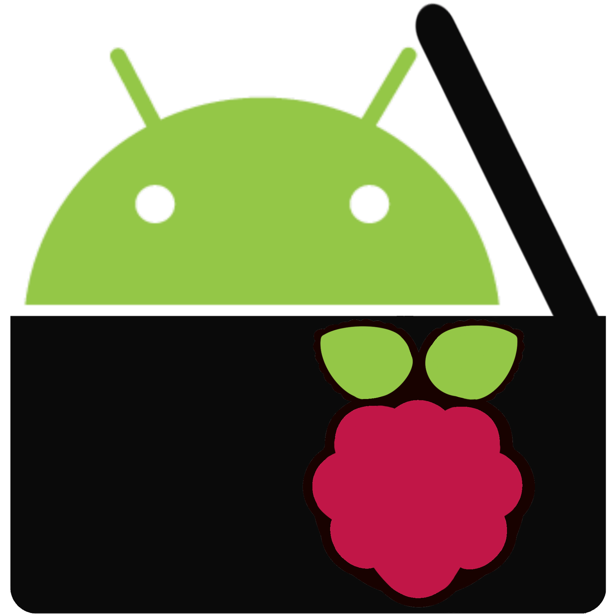

# Raspio

A controller software to connect radios with more modern smartphones. With the help of a Raspberry Pi and an antenna you can connect surrounding radios to play your own music simultaneously. Songs can be played through an Android app.

This repository is part of a school project so you might find documents that are designated to be viewed by teachers in order to fulfill the necessary requirements.

## Repository Structure

* `app` - Directory for the source code of the android app
* `documents` - Consists of needed documents for this school project
  * `assets` - Images to be used elsewhere in this repository
* `server` - Directory for the source code of the Raspberry Pi server application

## Documents

As stated in the repository structure the directory `documents` is used to store all the documents needed by teachers who may view this school project.

These files consist of: 

* [Project proposal](documents/Raspio%20Projektantrag.pdf)

## Software Distribution

Development previews of the app can currently be downloaded from our [F-Droid Repository](https://fdroid.bickositieff.me/repo/).

In the future there will also be prebuilt SD-Card images as well as an install script for configuration of the Raspberry Pi server.

## Documentation

The current API specification can be viewed at https://docs.bickositieff.me/.

## Legal

**© bickoSiTiEff. All rights reserved.**

This software is provided "AS IS".

In no event shall bickoSiTiEff be liable for any special, direct, indirect, consequential, or incidental damages or any damages whatsoever, whether in an action of contract, negligence or other tort, arising out of or in connection with the use of Raspio.

For legal problems please contact legal@bickositieff.me.

